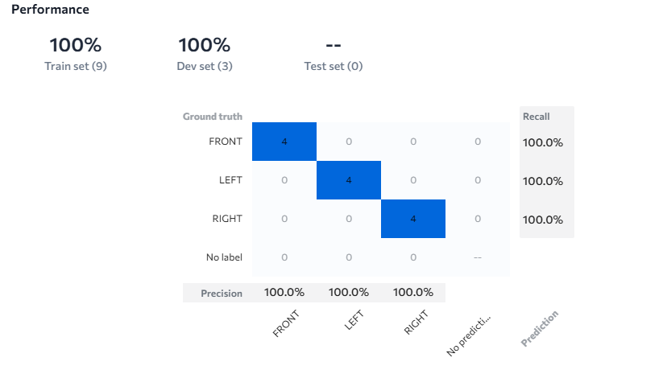

# FACE-POSITION-DETECTION-LANDINGAI
# Face Detection using LandingAI

## 📌 Project Overview
This project demonstrates **Face Detection** using **LandingAI platform**. The system is capable of detecting human faces from images and can be further extended to video streams. Face detection plays a crucial role in many applications such as **security systems, authentication, human-computer interaction, and healthcare analytics**.

---

## 🚀 Features
- Detects faces in real-time images.
- Uses **LandingAI** for training and inference.
- High accuracy with clear bounding box detection.
- Can be extended for **facial recognition or emotion detection**.

---

## 🛠 Tech Stack
- **LandingAI** (Model training & deployment)  
- **Python** (Data preprocessing & integration)  
- **OpenCV** (Image handling & visualization)  
- **Numpy, Matplotlib** (Data analysis & results plotting)  

---

## 📂 Dataset
- Dataset includes multiple human faces with variations in **lighting, angle, and expressions**.
- Preprocessed before training for better accuracy.

---

## 📊 Results

### ✅ Confusion Matrix
The confusion matrix represents performance across test images.

---

## 📱 QR Code (LandingAI Project Access)
Scan the QR code below to directly access the **LandingAI Face Detection project**:

---

## 📈 Future Improvements
- Extend to **Facial Emotion Recognition**.  
- Integrate with **real-time video feed** for surveillance.  
- Deploy as a **web app or mobile app** for wider use.  

---

## 👩‍💻 Author
- **Yashika Sharma**  
B.Tech CSE | AI-ML Enthusiast  

---
